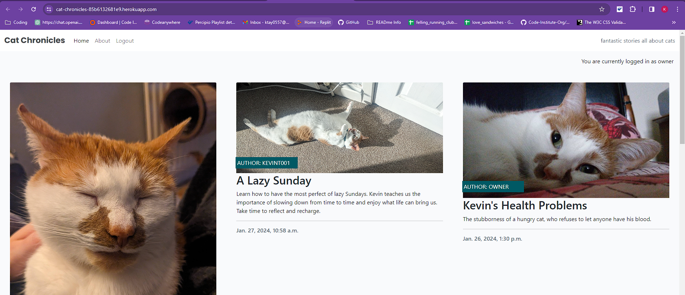
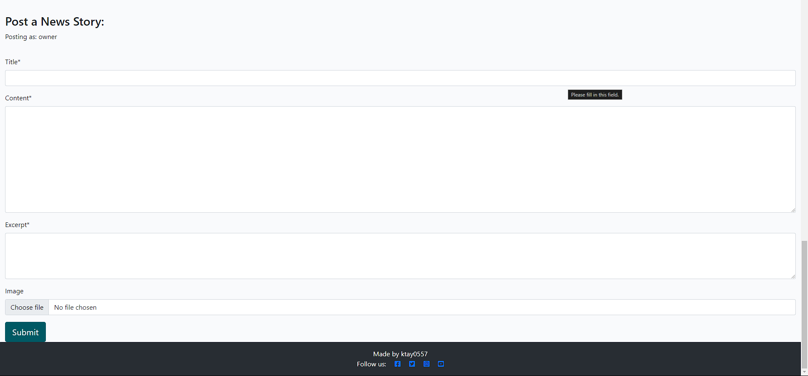
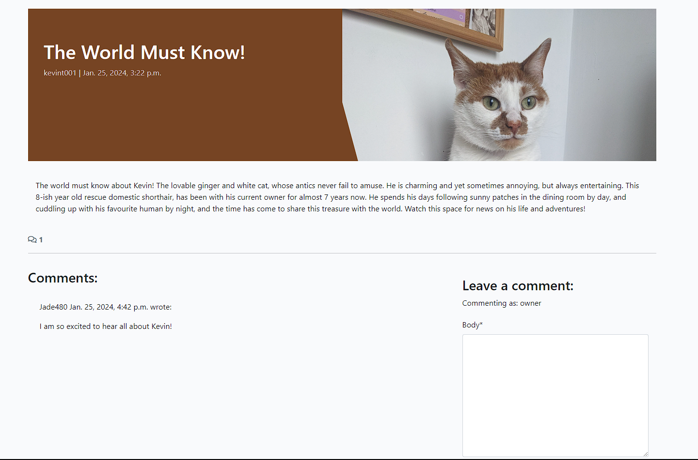
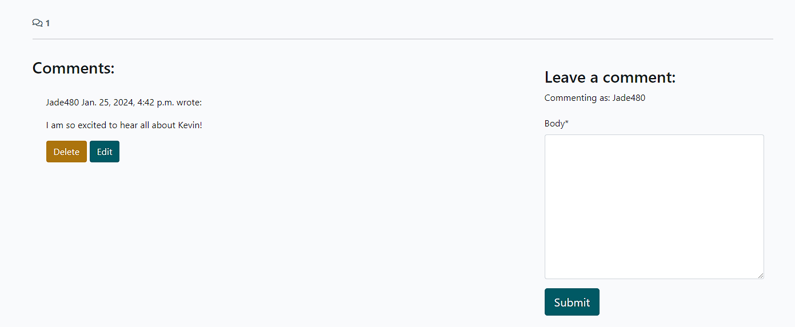

# Project 4 - Cat Chronicles

[Cat Chronicles](https://cat-chronicles-85b6132681e9.herokuapp.com/)

A community news site where cat owners and cat lovers can share their stories and their loved ones.

The homepage for logged in users.

A screenshot showing the form registered users can use to post a news story.

When users click on a news story, they are taken to a new page, where they are able to read the full story and any comments that have been posted.

Registered users are able to leave comments on stories, as well as edit and delete comments they have made.

## ERD's

|      User       |
| --------------- |
| Built-in model  |

|            |      Post      |             |
| ---------- | -------------- | ------------|
|            | title          | Char        |
|            | slug           | Slug        |
| ForeignKey | author         | User model  |
|            | featured_image | Cloudinary  |
|            | content        | Text        |
|            | created_on     | DateTime    |
|            | status         | Integer     |
|            | excerpt        | Text        |
|            | edited_on      | DateTime    |

|            |   Comment  |             |
| ---------- | ---------- | ------------|
| ForeignKey | post       | Post Model  |
| ForeignKey | author     | User model  |
|            | approved   | Boolean     |
|            | created_on | DateTime    |

|      |     About     |            |
| ---- | ------------- | -----------|
|      | title         | Char       |
|      | content       | Text       |
|      | profile_image | Cloudinary |
|      | edited_on     | DateTime   |

|      |Contact Request |          |
| ---- | -------------- | ---------|
|      | name           | Char     |
|      | email          | Email    |
|      | message        | Text     |
|      | read           | Boolean  |

## User Experience (UX)

### User stories

- As a Site User:
  
  - As a site user, I can view a paginated list of news stories so that I can select which news story I want to view
  - As a site user, I can click the About link so that I can read all about the site
  - As a site user, I can read cat news stories so that I can stay updated on the latest adventures and news about the cat
  - As a site user, I can fill in a contact form so that I can submit an enquiry

- As a Registered User:
  
  - As a registered user, I can post news stories so that I can share my cat's experiences with the community
  - As a registered user, I can create draft news stories so that I can finish writing at a later date
  - As a registered user, I can comment on news stories so that I can engage in discussions with other cat lovers
  - As a registered user, I can read and create news stories so that I can share in the experiences of others and myself

- As a Site Owner:
  
  - As a site owner, I can moderate user-generated content so that the community remains respectful and safe
  - As a site owner, I can edit and/or update the about page content so that it can be seen on the site
  - As a site owner, I can store contact enquiries in the database so that I can review them
  - As a site owner, I can mark contact enquiries as read so that I can see what I still need to process

## Technologies Used

### Languages Used

- HTML

- CSS

- Javascript

- Python

### Frameworks, Libraries, and Programs Used

1. GitHub:
   - GitHub is used to store the project codes after being pushed from Codeanywhere.
2. Git:
   - Git is used for version control, to enable commits to Git and the ability to Push to GitHub.
3. Google Fonts:
   - Google Fonts was used throughout the website, for aesthetic purposes in regards to the text.
4. Django (including extensions):
   - Django is the web framework used for building the project.
   - Django Allauth: Used for authentication and account management.
   - Django Crispy Forms: Used for styling Django forms.
   - Django Summernote: Integrated for rich-text editing functionality.
5. Cloudinary:
   - Cloudinary is used for managing and serving images.
6. Gunicorn:
   - Gunicorn is used as the WSGI server for the Django application.
7. Bootstrap:
   - Bootstrap is a front-end framework used for designing and styling the user interface.

## Testing

### Validating the Code

The first attempt at including the favicon did not work, as it did not load when previewing the website. This was a quick fix, as the file pathway was written incorrectly.

The project was validated using JSHint and the W3C Markup Validator, in order to ensure that the project contained no errors.

The JSHint gave warnings over const. But no errors.

The W3C Markup Validator was used to check the HTML on the pages. No errors or warnings to show.

The W3C CSS Validator was used to check the stylesheet. 'Congratulation! No Error Found', was the result.

The CI Python Linter was used to check the main code for the application. Two errors were reported for lines being too long. They were altered and the code was run through the linter again. All clear, no errors found.

### Manual Testing  using User Stories from UX Section

Manual testing was carried out every step of the way. Everytime a piece of code was written, it was tested before being committed and push to Git.

- As a Site User:
  
  - As a site user, I can view a paginated list of news stories so that I can select which news story I want to view
    - The homepage lists all the published stories so the user can see them. Each of the stories contains a title, the author, an image, and an excerpt. The user can decide from the list, which story they wish to read.
    - If the amount of stories is higher than 9, they will move to the next page and a Next button will appear, so the user can continue browsing. A Previous button appears after leaving the main page, so the user may go back.

  - As a site user, I can click the About link so that I can read all about the site
    - The About page was created so that site users may find out more about the page and creators. The link to the page can be found in the navbar of each and every page.

  - As a site user, I can read cat news stories so that I can stay updated on the latest adventures and news about the cat
    - The homepage displays a list of the most recently published news stories, with each one having a clear title, date of creation, and a summary.
    - The user can click on the title of a story they wish to read, and they will be taken to that story, where they are able to read it in full, along with any comments that may have been posted.

  - As a site user, I can fill in a contact form so that I can submit an enquiry
    - If a user goes to the about page, they will see a contact form. This form may be filled in with their name and message, as well as email if they want. The form is then submitted using the submit button and the site owner can review the messages via the admin panel.

- As a Registered User:
  
  - As a registered user, I can post news stories so that I can share my cat's experiences with the community
    - The creation of a form visible to registered users on the homepage, allows them to post new stories.
    - The form contains a submit button, as well as fields for a title, the content, and an optional image.
    - Once the form is submitted and approved, it is visible on the homepage.
    - This was tested by posting a story whilst signed in as the user 'owner'. Initially the form was missing the image option, then the image option became a strict requirement. That was fixed by changing the `self.fields['featured_image'].required = False` in the `forms.py` file for cat_news. This though created the problem of the excerpt then no longer being required, so that field was changed `self.fields['excerpt'].required = True` to help with that issue.
  
  - As a registered user, I can create draft news stories so that I can finish writing at a later date
    - Whilst in the admin panel, news stories are set as drafts by default. These can be edited at a later date and then set to published after approval.
    - This was tested by created news stories whilst in the admin panel, and saving them as drafts. One was then revisited and published.
  
  - As a registered user, I can comment on news stories so that I can engage in discussions with other cat lovers
    - When a user selects a story to read, they can also see the comment section. If the user is logged in, they also have the option of leaving a comment.
    - If a user has left a comment previously, they will also have the option to edit and/or delete their comment
    - This was tested by logging in as various users, to ensure comments could be left, but also to make sure users could not edit or delete other users comments.
  
  - As a registered user, I can read and create news stories so that I can share in the experiences of others and myself
    - Whilst a user is logged in, they are able to view the post form, which allows them to create news stories.
    - They may also read news stories that have already been approved and published.
    - This was tested by logging in as various users, and creating news stories, and also reading the ones already present.

- As a Site Owner:
  
  - As a site owner, I can moderate user-generated content so that the community remains respectful and safe
    - Within the admin panel, the site owner is able to review posts and comments and approve them to allow them to be visible on the website.
    - This was tested by creating a new news story, as well as some comments from various users, and then logging into the admin panel and checking them from there.
  
  - As a site owner, I can edit and/or update the about page content so that it can be seen on the site
    - Within the admin panel, there is a section for the about page, which allows the site owner to edit and update the page.
  
  - As a site owner, I can store contact enquiries in the database so that I can review them
    - Any enquiries submitted by a user are stored within the database.
    - The database includes the user's name and message, when it was submitted, as well as potentially an email.
    - This was tested by submitting an enquiry using the contact form. The enquiry can be seen in the admin panel.
  
  - As a site owner, I can mark contact enquiries as read so that I can see what I still need to process
    - Within the admin panel, any enquiries made will be stored by default as unread. This is seen straight away when the owner proceeds to the contact request database.

With more time, I would like to add additional functionality to the news story post form. I believe users would appreciate being able to edit and even possibly delete some stories they may post. It would also be nice to have to option to upload multiple images for a story.
Also, with more time, I would like to create user account pages, so a registered user can see everything they have posted and commented, all in one place.

## Deployment

Steps for deployment are as follows:

- Fork or clone this repository
- Create a new app on Heroku
- Add Config Var for the sensitive credentials and port
- Link the Heroku app to the repository
- Use the Deploy button

### GitHub Pages

The project was deployed to GitHub Pages using the following steps:

    1. Logged into GitHub and went to the specific GitHub Repository.
    2. In the Repository page, clicked on the "Settings" cog at the top of the page.
    3. In the "Code and automation" area, selected "Pages".
    4. Under "Source" option, choose "Deploy from a branch", followed by "main" and "/(root)".
    5. Refreshed the page, and at the top of the page is the published site link within "GitHub Pages" area.

### Forking the GitHub Repository

By forking the GitHub Repository, a copy can be created. This allows for viewing and editing, without affecting the original. The following steps show how:

    1. Log into GitHub, locate the GitHub Repository.
    2. "Fork" is towards the top of the page, select it.
    3. This provides a copy of the original repository.

### Making a Local Clone

    1. Start by logging into GitHub.
    2. Locate the required GitHub Repository.
    3. Click the "<> Code" dropdown option.
    4. The link can be copied and cloned.

## Credits

### Code

- Code Institute: Everything they have taught has led to this point. At times it was fun, others, very challenging. The walkthrough projects really help in gaining an understanding and also for providing inspiration.
- Stack Overflow: Helped with getting an understanding of how to get the post form to work during the set up stages, when I was making small errors and unsure where I was going wrong.

### Content

- All content was written by the developer, with the help of Code Instutite.

### Acknowledgements

- Kevin, for being my muse, and keeping me going even when I felt lost.
- Code Instutite, for their fantastic, manageable lessons helping me make sense of everything on this journey.

- p.s. I did have more images I would liked to have added to the README file, however, Codeanywhere kept stopping the file transfer, and reloading the workspace was becoming harder and harder. A lot of time was spent waiting for the workspace to load. I hope I was able to describe well enough. With more time, I would have waited longer in order to potentially have been able to upload more images.
